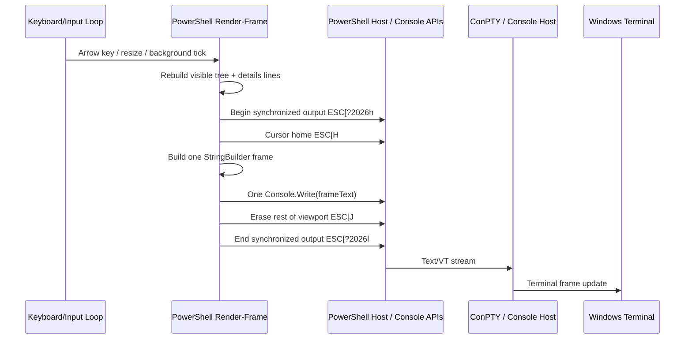

# PowerShell TUI Render Performance Limits & Research Guide

This document tracks the current `DeviceCheck.ps1` TUI rendering limits, what Gemini/Codex already improved, and what to research next before doing more UI surgery.

The short version: scrolling improved, but it will probably not become “butter smooth” while every navigation frame is still rebuilt through many PowerShell host writes. The next serious experiment should be measured frame batching: build one full ANSI frame string and emit it with one `[Console]::Write()` call.

---

## 1. Current State

Recent Gemini changes improved the TUI in the right direction:

- `Render-Frame` no longer clears the screen on every frame. Normal frames use cursor-home redraw with `ESC[H`.
- A force-clear flag is kept for resize/system-scan cases where a real clear is safer.
- Cached device evidence is kept in memory to avoid repeated disk reads and `ConvertFrom-Json` during navigation.
- ANSI stripping uses compiled regex objects.
- The visible row list is marked dirty and only rebuilt when needed during background scans.
- Layout height is clamped more aggressively to avoid accidentally writing into the scrollback area.

Current Codex follow-up:

- `Render-Frame` now builds the main navigation frame in a `StringBuilder`.
- The main navigation frame is emitted with one `[Console]::Write($frameText)` call instead of many `Write-Host` calls.
- `DEVICECHECK_TUI_PERF=1` enables a compact status-line metric with last-frame render time, frame characters, console writes, visible rows, and detail lines.
- Legacy/modal renderers remain unchanged for now.

That is why scrolling feels better now. The remaining softness is likely from the output path, not from one single broken math line.

---

## 2. Current Render Pipeline



The important thing: the main frame now avoids many individual host writes. If scrolling still feels soft, the next likely suspects are frame construction cost, detail pane work, and input repeat behavior.

---

## 3. Known Platform Facts

### Windows Terminal / VT Facts

Microsoft documents cursor movement, erase line/display, scroll margins, and alternate screen buffer through virtual terminal sequences. `ESC[H`, `ESC[K`, `ESC[J`, scroll margins, and alternate buffer mode are real tools, not hacks.

Source: [Console Virtual Terminal Sequences - Microsoft Learn](https://learn.microsoft.com/en-us/windows/console/console-virtual-terminal-sequences)

Useful facts from that source:

- Cursor positioning can move to an exact row/column.
- `ESC[J` and `ESC[K` erase display/line regions.
- Insert/delete line operations exist and are affected by scrolling margins.
- Scroll margins can define a scrolling region.
- Alternate screen buffer exists and has no scrollback region.

### ConPTY Facts

Windows Terminal sits on the modern Windows pseudo console pipeline. Microsoft’s ConPTY write-up explains that legacy console output and VT streams travel through a console/terminal translation path.

Source: [Introducing the Windows Pseudo Console (ConPTY) - Microsoft DevBlogs](https://devblogs.microsoft.com/commandline/windows-command-line-introducing-the-windows-pseudo-console-conpty/)

Useful facts:

- Windows historically differed from Unix terminals because classic apps used Console APIs instead of “speaking VT”.
- ConPTY allows terminal-style communication through pipes.
- Microsoft explicitly encourages new command-line apps to emit UTF-8 text/VT when they want terminal features.

### PowerShell Output Facts

`Write-Host` is not just a raw terminal byte write. It sends objects to the PowerShell host and uses the Information stream behavior.

Sources:

- [Write-Host - Microsoft Learn](https://learn.microsoft.com/en-us/powershell/module/microsoft.powershell.utility/write-host)
- [about_Output_Streams - Microsoft Learn](https://learn.microsoft.com/en-us/powershell/module/microsoft.powershell.core/about/about_output_streams)

Useful facts:

- `Write-Host` displays to the host and returns no pipeline output.
- `Write-Host` also writes to the Information stream.
- This is good for user messages, but for a dense TUI render loop it is probably slower than one raw `[Console]::Write($frameText)`.

### Input Facts

Microsoft’s console input documentation notes that key records can carry repeat counts when a key is held down.

Source: [Console Input Buffer - Microsoft Learn](https://learn.microsoft.com/en-us/windows/console/console-input-buffer)

Useful fact:

- Held keys can create repeated input records. If render time plus polling sleep is slower than the key repeat rate, input can queue and scrolling feels behind your finger.

---

## 4. Current Suspects

### Suspect A: Many `Write-Host` Calls Per Frame

This is the strongest suspect.

Before the current Codex follow-up, `Render-Frame` still wrote many lines individually:

```powershell
Write-UiBanner ...
Write-Host "status..."
Write-Host "pane titles..."
for (...) {
    Write-Host "left line + divider + right line"
}
Write-UiShortcutSegments ...
Write-Host "$($_E)[J" -NoNewline
```

Even if each line is “fast”, every call crosses PowerShell host machinery. This experiment is now implemented for the main frame, so the next test is user feel plus `DEVICECHECK_TUI_PERF=1` numbers.

### Suspect B: Full Frame Rebuild On Every Arrow

Even with caching, each arrow key regenerates:

- tree line strings,
- selected detail lines,
- ANSI-aware width calculations,
- header/status/footer text.

This is acceptable for correctness, but it sets a ceiling. A diff-renderer could be faster, but it is also much easier to break.

### Suspect C: Key Repeat Queue

The loop sleeps for 40 ms when idle and 150 ms during background evidence scans. On a held arrow key, Windows may generate repeated key events faster than the loop can draw. That creates the feeling of soft delayed scrolling.

Possible fix: drain repeated arrow keys and apply only the latest/aggregate movement per frame.

### Suspect D: Details Pane Cost

The selected details pane can build up to 200 detail lines even when only a small slice is visible. This is safe and simple, but it may be wasteful during tree scrolling where the selected device changes constantly.

Possible fix: cache `Get-DetailDisplayLines` per selected row/evidence version/window width, or only build enough detail lines for the visible slice when the detail pane is not focused.

---

## 5. Experiments To Try In Order

### Experiment 1: Measure Before More Changes

Implemented first-pass render timing counters:

- `RenderMs`
- `FrameChars`
- `ConsoleWrites`
- `VisibleRows`
- `DetailLines`

Show them only when a debug flag is enabled, for example `$env:DEVICECHECK_TUI_PERF = 1`.

Goal: know whether the bottleneck is render construction, frame size, or remaining input queue lag.

### Experiment 2: Single-Write Frame Buffer

Implemented for `Render-Frame` only, not every legacy/helper screen.

Target shape:

```powershell
$frame = [System.Text.StringBuilder]::new()
$null = $frame.Append("$_E[?2026h")
$null = $frame.Append("$_E[H")
$null = $frame.AppendLine($bannerLine1)
$null = $frame.AppendLine($bannerLine2)
...
$null = $frame.Append("$_E[J")
$null = $frame.Append("$_E[?2026l")
[Console]::Write($frame.ToString())
```

Expected result to test:

- fewer PowerShell host crossings,
- lower frame time,
- less softness while holding arrows.

Risk:

- helper functions that currently write directly must become “return string lines” functions, at least for the main render path.

### Experiment 3: Aggregate Repeated Arrow Keys

When a key is read and more matching arrow keys are already queued, drain them and apply a capped movement.

Example idea:

```text
DownArrow held -> read 6 queued DownArrow records -> move selectedIndex by min(6, 8) -> render once
```

This can feel smoother because the UI catches up instead of drawing every intermediate row.

Risk:

- if too aggressive, selection may jump too much.
- should apply only to navigation keys, not `E`, `S`, `A`, `M`, `Q`, etc.

### Experiment 4: Details Pane Render Cache

Cache detail lines by:

```text
selected InstanceId / row type
right pane width
evidence cache timestamp/hash
active search state summary
```

This may help when moving around already-scanned devices, but it is more complex because active background status must invalidate the right rows.

### Experiment 5: Scroll Region / Partial Tree Scroll

Use VT scrolling margins and insert/delete line sequences to scroll only the tree body. Microsoft documents scroll margins and insert/delete line sequences, so this is possible in principle.

This is probably not the next move. It is a larger architecture change and much easier to corrupt during resize, dual-pane mode, and background scan updates.

---

## 6. What To Search Online

Use these exact prompts for Deep Research / Gemini / ChatGPT.

### Deep Research Prompt: Windows Terminal TUI Limits

```text
We are building a PowerShell 7 TUI in Windows Terminal on Windows 11.

Current render loop:
- immediate-mode full-frame redraw
- cursor home ESC[H
- erase-down ESC[J
- synchronized output ESC[?2026h / ESC[?2026l
- many Write-Host calls per frame
- dual-pane layout inside one terminal grid
- [Console]::KeyAvailable polling + RawUI.ReadKey

Research the practical performance limits and best practices for this stack:
1. Windows Terminal + ConPTY rendering cost for immediate-mode redraws.
2. Whether batching the whole frame into one [Console]::Write is measurably better than many Write-Host calls.
3. How to handle held arrow-key repeat without queue lag in a PowerShell TUI.
4. Whether DEC synchronized output 2026 is supported and reliable in Windows Terminal, and what fallback is appropriate.
5. Whether VT scroll regions / insert-delete lines are worth using for a two-pane PowerShell TUI, or whether they add too much fragility.

Prioritize official Microsoft docs, Windows Terminal GitHub issues/source, PowerShell docs, and mature TUI library implementations. Separate hard facts from inference.
```

### Search Terms

```text
Windows Terminal ConPTY immediate mode TUI rendering performance
PowerShell TUI StringBuilder Console.Write vs Write-Host performance
PowerShell KeyAvailable ReadKey held arrow key repeat lag
Windows Terminal synchronized output DECSET 2026 support
Windows console virtual terminal scroll margins insert delete line performance
PowerShell alternate screen buffer Windows Terminal TUI
microsoft terminal ConPTY rendering performance issue
```

### Gemini / Antigravity Implementation Job

```text
Repo: DeviceCheck
File: DeviceCheck.ps1

Goal:
Improve TUI scrolling smoothness without changing behavior.

Constraints:
- Do not add workaround features that do not solve the actual visible problem.
- Do not break dual-pane layout, resize behavior, background evidence scans, or root/category scan hotkeys.
- Preserve synchronized output and cursor-home redraw.
- Keep changes measurable and reversible.

Task:
1. Add optional TUI perf metrics behind DEVICECHECK_TUI_PERF=1:
   RenderMs, FrameChars, HostWriteCalls, VisibleRows, DetailLinesBuilt, KeyQueueDrained.
2. Refactor only the main Render-Frame path so one frame is emitted through one [Console]::Write call.
3. Leave Render-FrameLegacy and modal/model selector screens alone unless required.
4. Add a small helper for appending ANSI lines to a StringBuilder.
5. Parser-test DeviceCheck.ps1.
6. Report before/after observations from manual arrow-key scrolling.

Do not implement VT scroll regions yet.
Do not add mouse/copy shortcuts.
```

---

## 7. Codex Recommendation

The next code change should be:

1. Add optional perf counters.
2. Convert main `Render-Frame` from many `Write-Host` calls to one buffered `[Console]::Write`.
3. Test manually in Windows Terminal with:
   - tree focused, hold DownArrow,
   - details focused, hold DownArrow,
   - background evidence scan active,
   - window resize,
   - root/category expanded with many devices.

If that does not improve smoothness enough, then try key-repeat aggregation. Do not jump straight to VT scroll regions; they are powerful but likely fragile for this app.
