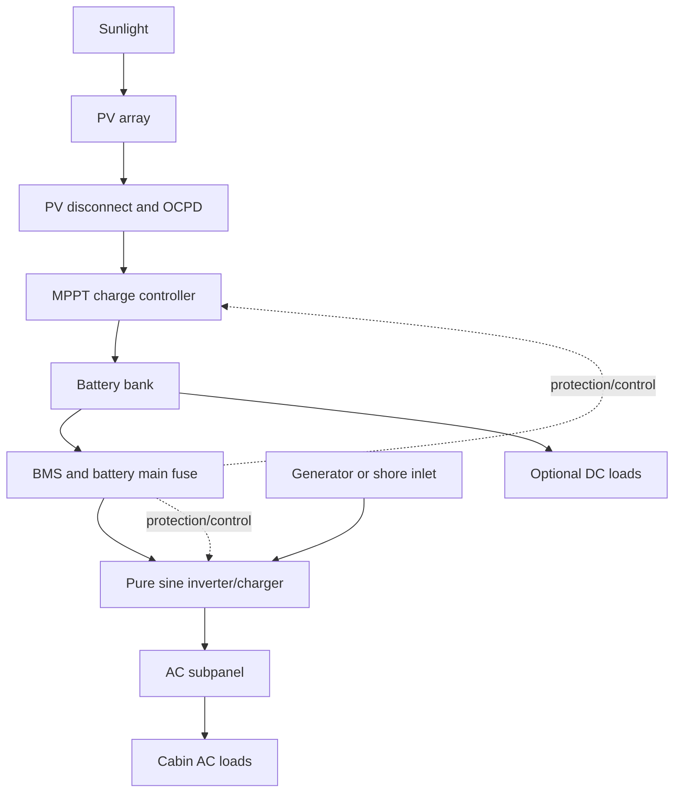
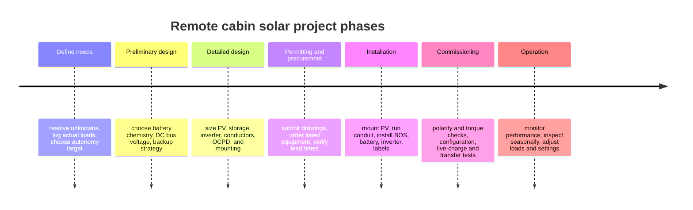

# Small Off-Grid Solar Plus Battery Plan for a Remote Cabin

## Executive summary

A small remote-cabin solar-plus-battery system should be designed from the loads backward, not from panel wattage or battery amp-hours forward. Because the cabin location, climate, daily energy needs, budget, and desired autonomy are all unknown, a final system size cannot be responsibly fixed yet. Still, a defensible planning path is clear: define measured loads; decide whether the cabin is a three-season, efficient four-season, or heavy-winter-use site; then size PV from *worst-month solar resource* and size storage from *usable* battery energy rather than nameplate capacity. For a modest cabin that excludes electric resistance space heating and electric domestic hot water, a practical starting point is often a pure-sine inverter/charger in the roughly 2–3 kVA class, an MPPT charge controller, and a battery in the LiFePO4 class with a temperature-aware BMS and generator backup capability. Victron’s current product set explicitly targets off-grid/backup applications, offers official sizing tools, and publishes current price lists, manuals, certificates, and schematics through its official site and dealer network. citeturn27view0turn51view0turn52view0turn59view0turn30view0

Among controller choices, MPPT is the default recommendation for most cabin systems because it can operate the array at maximum power rather than forcing the array to battery voltage, it tolerates higher PV string voltages, and it materially outperforms PWM in many realistic conditions. In Victron’s own technical comparison, a 100 W panel at 25 °C produced 100 W through MPPT versus 81 W through PWM in the illustrated case; Victron also notes that PWM becomes more defensible only for smaller systems where panel voltage closely matches battery voltage and temperature/shading losses are not significant. citeturn62view0turn51view0turn61view0

For batteries, LiFePO4 is the strongest default stationary-cabin option when the budget allows. Victron’s 25.6 V Lithium NG data show 92% round-trip efficiency, cycle life of 2,500 cycles at 80% DoD, 3,000 cycles at 70% DoD, and 5,000 cycles at 50% DoD, but also a strict charging temperature window of +5 °C to +50 °C and a requirement for an approved BMS. Flooded lead-acid remains viable where upfront purchase cost is the primary constraint and regular maintenance is acceptable, but Trojan’s guidance still requires ventilation, PPE, watering, and careful storage practices. citeturn46view0turn47view0turn38view0

For codes and permitting, the right answer is jurisdiction-specific. In the United States, the NEC is the controlling baseline, the 2023 edition is the current edition, and local authorities can adopt amendments or lag the latest edition. For this type of project, the most relevant U.S. buckets are PV requirements, stand-alone system requirements, grounding and bonding, batteries/ESS requirements, and rooftop rapid-shutdown rules where applicable. Product certification also matters: the Victron sources gathered here show UL 1741 and IEC 62109 coverage for charge controllers and inverter/chargers, while Victron’s Lithium NG battery documentation identifies UL 1973, UL 9540A, and IEC 62619 on the battery/cell side. citeturn56search0turn60view1turn63view0turn63view1turn46view0

The single biggest design trap is trying to power electric space heating with a “small” off-grid system. Include heating in the load audit, but treat electric resistance heating as a decision that usually moves the project out of the small-cabin category and into a very different cost, array, and battery class. In most small-cabin cases, non-electric heating or a separate heating fuel should remain the baseline assumption unless the site and budget explicitly support much larger PV and storage. This report therefore sizes an illustrative system around a modest, efficient cabin load profile and treats electric heating as a template load to analyze separately rather than as a default design requirement.

## System goals and design basis

The following planning unknowns come directly from the project brief and should be treated as unresolved design variables until you have site and usage data.

| Design variable | Current status | Why it matters |
|---|---:|---|
| Cabin location | Unknown | Determines worst-month sun hours, snow/wind loading, and code jurisdiction |
| Climate | Unknown | Determines battery temperature strategy, controller cold-voltage checks, seasonal production |
| Daily energy need | Unknown | Primary driver of PV and battery size |
| Budget | Unknown | Dictates chemistry, modularity, and whether generator backup is essential |
| Desired autonomy | Unknown | Directly determines required usable battery capacity |
| Mounting type | Unknown | Roof vs ground affects permitting, rapid shutdown, structural work, and snow shedding |
| Backup source | Unknown | Generator integration changes inverter/charger choice and fuel planning |

To make the report concrete, the *illustrative* sizing example below uses these explicit assumptions:

| Illustrative planning assumption | Value |
|---|---:|
| Cabin type | Small efficient cabin |
| Electric space heat / water heat | No, not in baseline |
| Daily energy | 2.5 kWh/day AC loads |
| Peak continuous demand | About 1.0–1.5 kW |
| Motor/compressor surge | Refrigerator + small pump; plan for higher short surge |
| Desired autonomy | 2 days |
| Battery choice in baseline example | LiFePO4 |
| Battery-bank DC nominal voltage | 24 V |
| PV design solar resource for example | 3.0 peak-sun-hours/day in worst design month |
| PV performance ratio | 0.75 planning value |

A 24 V DC bus is a sensible “small-cabin” default for a system in this size range because it keeps current lower than 12 V while avoiding the complexity of small 48 V builds. If you expect long DC runs, larger inverter power, a heat pump later, or significant future expansion, move directly to 48 V.

A brief scope note: an uploaded file in this conversation concerns a separate monitor/EDID prompt and did not materially inform this solar report. fileciteturn0file0

## Load analysis and sample load chart

The load-analysis method should be strict and boring. That is a compliment. The correct process is to inventory every load, separate *continuous*, *cyclical*, and *surge* loads, and record both *daily energy* and *instantaneous power*. Nameplate watts alone are not enough for motors, refrigeration, pumps, chargers, satellite internet equipment, or seasonal heater fans. Use the formula:

`W × hours/day × duty cycle = Wh/day`

Then add a separate column for surge or locked-rotor behavior.

A practical cabin audit should track at least these classes:

| Load class | What to record | Why it matters |
|---|---|---|
| Lighting | Lamp wattage, quantity, hours by season | Usually easy to optimize aggressively |
| Refrigeration | Running watts, duty cycle, surge | Often the most important 24/7 load after communications |
| Heating | Type of heater and whether electricity is only controls/fans or actual heat | This can make or break the “small system” concept |
| Water pumping | Pump watts, starts/day, run-time/day, pressure-tank strategy | Short runtimes but meaningful surge |
| Communications | Router, LTE modem, satellite equipment, camera/NVR, boosters | Many cabins underestimate these 24/7 loads |
| Miscellaneous | Laptop, phones, appliance charging, tools, microwave, fan | Often dominate evening peaks |

An example *template* profile for early planning is below. These are not measurements; they are placeholders to help you structure the audit.

| End use | Example power | Example runtime / duty | Example daily energy | Notes |
|---|---:|---:|---:|---|
| LED lighting | 4 × 9 W = 36 W | 4 h/day | 144 Wh | Efficient and easy to reduce |
| Efficient refrigerator | 60 W running | 35% duty over 24 h | 504 Wh | Must capture compressor surge separately |
| Heater controls / fan only | 20–50 W | 6–10 h/day | 120–500 Wh | Acceptable in small systems |
| Electric resistance heater | 750–1,500 W | 2–6 h/day | 1.5–9.0 kWh | Usually too large for a “small” cabin baseline |
| Pressure pump | 60–150 W | 0.2–0.5 h/day | 12–75 Wh | Low energy, but startup current matters |
| LTE router / modem | 10–20 W | 24 h/day | 240–480 Wh | Quiet but relentless |
| Satellite internet class | 25–75 W | 24 h/day | 0.6–1.8 kWh | Often a system-size driver |
| Laptop / device charging | 40–100 W | 2–4 h/day | 80–400 Wh | Often concentrated at night |

### Sample 24-hour load chart

The following *illustrative* 24-hour chart matches the 2.5 kWh/day baseline used later in the sizing example.

| Hour | Average load |
|---|---:|
| 00 | 57 W |
| 01 | 57 W |
| 02 | 57 W |
| 03 | 57 W |
| 04 | 57 W |
| 05 | 57 W |
| 06 | 75 W |
| 07 | 150 W |
| 08 | 57 W |
| 09 | 57 W |
| 10 | 57 W |
| 11 | 57 W |
| 12 | 117 W |
| 13 | 57 W |
| 14 | 57 W |
| 15 | 57 W |
| 16 | 57 W |
| 17 | 75 W |
| 18 | 150 W |
| 19 | 250 W |
| 20 | 320 W |
| 21 | 320 W |
| 22 | 180 W |
| 23 | 75 W |

**Illustrative daily total:** about **2.51 kWh/day**.

The right way to improve this chart is not to “round it down,” but to replace assumptions with measurements. For a real cabin, track at least one representative summer week and one representative winter week before final procurement.

## Sizing methodology

### PV array sizing

The core energy-balance equation is:

`PV array size (W) = daily energy (Wh/day) ÷ [peak-sun-hours × performance ratio]`

For the baseline example:

- Daily energy = **2,500 Wh/day**
- Worst-month PSH = **3.0 h/day**
- Performance ratio = **0.75**

So:

`2,500 ÷ (3.0 × 0.75) = 1,111 W`

That is the *minimum* energy-balance result. A real cabin should then add margin for seasonal mismatch, snow cover, smoke, dust, module aging, and imperfect orientation. A practical planning result for this example is therefore **about 1.4–1.6 kW of PV**, not merely 1.1 kW.

Controller selection must then respect the manufacturer’s voltage/current bounds. Victron’s controller naming convention is explicit: the first number is the **maximum PV open-circuit voltage**, and the second is the **maximum charge current**. Victron also publishes an MPPT calculator specifically for this selection step. citeturn51view0

One of the most important site-specific checks is *cold-weather Voc*. As module temperature drops, PV voltage rises; therefore the string Voc at record-low expected temperature must remain below the controller’s maximum PV input voltage. This is one reason MPPT controller selection cannot be separated from climate and location.

### Battery-bank sizing

Battery sizing should be based on **usable** energy, not nominal nameplate energy. A practical planning equation is:

`Required nominal battery energy = daily energy × autonomy ÷ (usable DoD × battery efficiency)`

Using the 2.5 kWh/day example and **2 days** of autonomy:

`5.0 kWh usable needed`

Representative planning outcomes:

| Chemistry | Planning usable DoD | Planning battery efficiency | Approx. required nominal bank for 2.5 kWh/day and 2 days |
|---|---:|---:|---:|
| Lead-acid | 50% | 85% | ~11.8 kWh |
| Li-ion | 80% | 90% | ~6.9 kWh |
| LiFePO4 | 85% | 92% | ~6.4 kWh |

For LiFePO4, the official Victron data support the key point: round-trip efficiency is 92%, and cycle life remains substantial even at relatively deep cycling, but charging must stay inside the manufacturer’s temperature window and an approved BMS is mandatory. citeturn46view0turn47view0

### Inverter and charger sizing

Inverters should be sized to **peak simultaneous AC load plus surge behavior**, not only to daily kWh. For cabins, the main culprits are refrigerators, well/pressure pumps, microwave ovens, coffee makers, and power tools.

For the baseline 2.5 kWh/day cabin, a **pure-sine inverter/charger around 24 V, 3 kVA** is a rational starting point because it gives comfortable room for evening appliance use, refrigerator starts, and generator charging without forcing the battery bank into the much higher current of a 12 V architecture. Victron’s MultiPlus-II is marketed for land-based off-grid systems, provides two AC outputs, integrates a charger, supports PowerAssist/PowerControl, and transfers to inverter power in under 20 ms. citeturn59view0turn52view0

If a generator is part of the design, an inverter/charger is preferable to a stand-alone inverter because it centralizes AC transfer, battery charging, and source management.

## Component selection and system architecture

### Battery chemistry comparison

The table below uses **planning characteristics**, not universal guarantees. Final values must come from the exact battery datasheet you intend to buy.

| Chemistry | Best fit in a cabin | Main strengths | Main weaknesses | Maintenance / controls | Bottom-line planning view |
|---|---|---|---|---|---|
| Lead-acid | Lowest upfront-cost builds; cabins where regular checks are acceptable | Familiar, widely available, tolerant of simple charging systems | Heavy, large, lower usable energy per nameplate kWh, deeper cycling shortens life | Flooded types need ventilation, water checks, cleanliness, and proper storage; never leave discharged in storage | Use when budget dominates and you accept larger banks and maintenance |
| Li-ion | Space/weight-sensitive builds more than stationary cabins | Higher energy density than LFP | Usually a less compelling trade for stationary DIY cabins than LiFePO4; thermal and protection design deserve more attention | Requires robust BMS and integration discipline | Technically viable, but often not the first stationary-cabin choice |
| LiFePO4 | Best default for most modern small stationary off-grid cabins | High efficiency, strong cycle-life, good stationary safety profile, smaller bank for same usable energy | Cannot be charged below manufacturer minimum temperature unless heated/controlled; requires approved BMS | BMS is mandatory; temperature strategy is mandatory in cold climates | Best overall default when budget supports it |

Victron’s Lithium NG data show 92% round-trip efficiency, charge temperature from +5 °C to +50 °C, discharge from -20 °C to +50 °C, and detailed standards references including UL 1973, UL 9540A, and IEC 62619. Trojan’s flooded-lead-acid guidance confirms the maintenance burden: PPE, ventilation, periodic watering, clean terminals, and storage only when fully charged. Secondary chemistry summaries also support the broad industry distinction that higher-energy-density lithium-ion chemistries trade away some of LiFePO4’s stationary-storage advantages. citeturn46view0turn47view0turn38view0turn36search0turn35search7

### Inverter topology comparison

For cabins, the meaningful comparison is less about abstract circuit topology and more about **system architecture**.

| Architecture | What it does well | Tradeoffs | Best use |
|---|---|---|---|
| Pure-sine stand-alone inverter | Simple AC conversion from battery | Needs separate charger, transfer switch, and generator integration | Very small cabins with no generator or shore/genset charging |
| Inverter/charger | Adds AC charging and transfer in one unit | More expensive than inverter-only | Best default for cabins with generator backup |
| Inverter/charger/MPPT all-in-one | Fewer boxes, fewer interconnects, easier install | Single point of failure; less modular serviceability than separate boxes | Cost-sensitive builds and fast installs |
| Parallel- and split-phase-capable inverter/charger | Scales when cabin grows | More planning complexity up front | Larger cabins or later expansion |

Victron’s inverter/charger pages explicitly separate these architectures. MultiPlus-II is positioned for land-based off-grid use with charger and transfer capability, while Victron’s “Inverter/charger/MPPT” products are positioned as easy-to-install all-in-one solutions. The Inverter RS Smart Solar page also confirms that high-frequency integration can reduce weight substantially in modern designs. citeturn52view0turn59view0turn51view1turn51view2

### Charge-controller comparison

| Controller type | How it works | Where it fits | Main caution |
|---|---|---|---|
| PWM | Effectively switches the panel close to battery voltage | Tiny matched-voltage systems, hot climates, lowest-cost builds | Leaves energy on the table whenever panel Vmp is materially above battery voltage |
| MPPT | Tracks the array maximum-power point and transforms higher PV voltage down to battery voltage | Default choice for most cabins | Costs more than PWM, but usually pays back in energy harvest and design flexibility |
| Integrated inverter/MPPT | Combines PV tracking with inverter functions | Compact all-in-one systems | Greatly simplifies installation but concentrates failure risk |

Victron’s technical note explains that PWM is fundamentally not a DC-DC transformer and typically ties panel voltage close to battery voltage, while MPPT decouples array and battery voltages and harvests the maximum power point. In the example shown by Victron, the same 100 W panel yielded 81 W through PWM versus 100 W through MPPT at 25 °C, while very hot-cell conditions reduced the difference dramatically. Victron also states that PWM is the more economical choice only for smaller systems where PV voltage closely matches battery voltage and important temperature/shading losses are not expected. citeturn62view0turn51view0turn61view0

### Wiring, protection, grounding, thermal management, and maintenance

On the DC side, the design should include a string combiner or equivalent protected entry when multiple strings are paralleled, a PV disconnect, appropriate overcurrent protection, battery main overcurrent protection located as close as practicable to the battery positive bus, and clearly labeled battery and inverter disconnect means. On the AC side, treat the inverter output like a small service: use a proper subpanel, breakers matched to conductor ampacity, and a transfer/charging topology consistent with the inverter manual and local code. Final conductor and OCPD sizing must follow the selected equipment manuals and the locally adopted code edition. NEC adoption and enforcement vary by jurisdiction. citeturn56search0turn45view0turn59view0

For grounding and mounting, use listed module/racking bonding hardware and a mounting system whose listing covers bonding/grounding and loading for the chosen module family. UL’s standards catalog reference identifies **UL 2703** as the relevant rack-mounting/clamping standard for PV modules. For rooftop systems in the U.S., **rapid shutdown** may also be part of the design path under NEC 690.12; one route in the market is a **UL 3741** listed rooftop-PV-system approach. Because roof/ground mounting details are highly site-specific, final structural and grounding details should be taken from the exact racking manufacturer’s engineering documentation and your permit set. citeturn57search2turn65view0

Thermal management is not optional. Trojan says flooded batteries should be charged in a well-ventilated area and stored fully charged in a cool, dry place. Victron’s Lithium NG manual requires charging only between +5 °C and +50 °C and discharging only between -20 °C and +50 °C. In cold climates, that means you should either place LiFePO4 in an insulated conditioned space or use a heated battery enclosure strategy. In hot climates, do not bury the inverter and controller in a sealed closet; leave service clearances and airflow so electronics do not derate or age prematurely. citeturn38view0turn46view0turn47view0

Maintenance planning should match chemistry. Flooded lead-acid needs watering, terminal cleaning, and storage discipline. LiFePO4 removes most routine battery maintenance but increases the importance of firmware/configuration sanity, temperature management, and BMS health monitoring. Victron explicitly recommends monitoring and configuration through VictronConnect/GX devices, while Trojan advises scheduled inspection and watering for flooded batteries. citeturn38view0turn44view0turn45view0

### Vendor and source recommendations

For this class of project, the safest procurement order is:

1. **Official manufacturer documentation first**: datasheets, manuals, certificates, and “where to buy” locators.
2. **Authorized dealers / installers second**: especially for warranty handling, compatibility review, and field support.
3. **Anonymous marketplace bundles last**: only if you can independently verify listings, certifications, and support.

The strongest documented sourcing path in this research run is the Victron ecosystem because the official site provides a “Where to buy” locator, price list, manuals, MPPT calculator, product comparison resources, and certificates for the relevant hardware classes. Trojan’s official site also provides product-technology resources and maintenance guidance for flooded lead-acid batteries. citeturn27view0turn30view0turn51view0turn52view0turn38view0

### System operation flowchart



## Codes, permitting, installation checklist, and commissioning

### Permitting and regulatory considerations

If the cabin is in the United States, treat the **2023 NEC** as the current baseline and confirm the actually adopted edition with the local authority having jurisdiction, because adoption lags and amendments are common. For this project type, the design review will typically touch PV rules, stand-alone system rules, grounding/bonding, energy-storage rules, and roof-mounted rapid-shutdown requirements where applicable. citeturn56search0turn65view0

A sound permitting package should therefore identify at least:

- Site plan and array location
- Structural mounting detail and attachment schedule
- Single-line electrical diagram
- Conductor schedule and overcurrent/disconnect schedule
- Equipment datasheets and listing/certification sheets
- Grounding/bonding detail
- Labels, placards, and shutdown procedure
- Battery location, ventilation, temperature control, and fire-safety note

Where IEC-oriented documentation is required instead, the most relevant families are the PV commissioning/documentation standards, converter safety standards, and industrial battery safety standards. The Victron source set gathered here directly references IEC 62109 for charge controllers/inverter equipment and IEC 62619 for the lithium battery side, which is useful even when final compliance is jurisdiction-specific. citeturn60view1turn63view1turn46view0

### Step-by-step installation checklist

1. **Verify the design basis**: confirm daily energy, surge loads, autonomy target, PV mounting location, and battery temperature strategy.  
2. **Freeze the electrical architecture**: choose 24 V or 48 V, select chemistry, and decide whether generator integration is required.  
3. **Check certifications and compatibility**: verify that inverter/charger, controller, battery, and mounting all have appropriate listings/certificates for your jurisdiction. Victron’s charge controllers show UL 1741 / IEC 62109 coverage; MultiPlus-II documentation also lists UL 1741 and IEC 62109 / IEC 62116 references; Victron Lithium NG references UL 1973 / UL 9540A / IEC 62619. citeturn60view1turn63view0turn63view1turn46view0  
4. **Confirm cold-string voltage**: calculate worst-case PV string Voc for the local minimum temperature and confirm it stays below the controller’s maximum PV voltage. Use the controller naming rule and MPPT calculator, then verify against the module datasheet. citeturn51view0  
5. **Mount the array and route conduit**: install racking per manufacturer engineering, maintain weatherproof roof penetrations, and avoid future shading.  
6. **Install PV BOS**: combiner/disconnect/SPD as required, proper polarity labeling, and waterproof cable entries.  
7. **Install battery enclosure and battery**: provide ventilation for lead-acid or thermal control for LiFePO4, keep clearances for service, and secure the battery against movement. Trojan highlights ventilation and safety for flooded batteries; Victron requires secure mounting and approved BMS use for lithium. citeturn38view0turn47view0  
8. **Install inverter/charger and AC subpanel**: keep cable runs short, observe clearances, isolate critical loads if the design uses them, and connect generator/shore AC input if included.  
9. **Install battery protection and monitoring**: battery main fuse, disconnect, shunt, BMS, communication links, and labels. Victron’s lithium guidance explicitly requires an approved NG BMS and an external safety relay. citeturn47view0  
10. **Terminate and torque conductors**: use the correct lugs, anti-oxidation compounds where required, strain relief, and documented torque values.  
11. **Program charging and protection settings**: set battery chemistry, absorb/float strategy, low-voltage cutoffs, charge-temperature limits, and generator charging rules.  
12. **Commission under supervision**: energize in the correct order, document measured values, and create an as-built binder with diagrams, settings, manuals, and warranty records.

### Commissioning tests

At minimum, commissioning should document these checks:

1. **Visual and mechanical inspection**: correct polarity, no damaged insulation, correct labels, proper strain relief, no loose lugs, and all covers installed.  
2. **PV string verification**: measure each string’s open-circuit voltage and confirm expected polarity before landing on the controller.  
3. **Battery verification**: confirm resting voltage/SOC, correct series or parallel wiring, BMS communications, and main fuse/disconnect operation.  
4. **Grounding and bonding continuity**: verify the racking, equipment enclosures, and grounding electrode system are bonded as designed.  
5. **Controller startup**: confirm controller sees the proper battery voltage and PV voltage, then verify charging current under live sun.  
6. **Inverter output test**: measure AC voltage and frequency unloaded, then with representative loads.  
7. **Transfer/charger test**: if using an inverter/charger, verify generator or shore input is accepted, charging begins, and transfer to inverter occurs properly. Victron states MultiPlus-II transfer occurs in under 20 ms. citeturn59view0  
8. **Load test**: run the highest realistic simultaneous cabin load, including fridge and pump starts if possible.  
9. **Protection test**: verify BMS alarms, disconnect behavior, low-voltage thresholds, and controller charging limits.  
10. **Thermal check**: after 30–60 minutes under charging/discharging load, inspect for abnormal temperature rise at lugs, breakers, fuses, busbars, and battery connections.  
11. **Documentation closeout**: record settings, measured voltages/currents, test date, firmware versions, and owner operating instructions.

## Sample bill of materials, requested visuals, and project timeline

### Sample bill of materials

The sample BOM below is sized around the **illustrative 2.5 kWh/day, 2-day autonomy** planning case. Prices shown from Victron are from the official **2026 Q2 EUR ex VAT** price list, which Victron says is guidance only and may vary by local conditions. Allowance-based line items are clearly marked as such. citeturn30view0turn31view0turn32view3turn48view0turn49view2turn33view1

| Item | Sample selection | Qty | Estimated cost |
|---|---|---:|---:|
| PV modules | Commodity crystalline modules totaling about 1.4–1.6 kW | 4 | **Allowance:** €250–€450 |
| Charge controller | Victron SmartSolar MPPT 150/60 | 1 | **€375** |
| Inverter/charger | Victron MultiPlus-II 24/3000/70-32 | 1 | **€894** |
| Battery | Victron LiFePO4 Battery 25.6V/300Ah NG | 1 | **€2,695** |
| Battery management | Approved NG BMS architecture | 1 | **Allowance:** €158 and up |
| Battery monitor | Victron SmartShunt 500A | 1 | **€107** |
| PV disconnect / combiner / SPD | DC-rated BOS | 1 set | **Allowance:** €150–€400 |
| Battery main fuse / DC disconnect / busbars | DC-rated BOS | 1 set | **Allowance:** €250–€500 |
| AC subpanel / breakers / inlet hardware | Code-compliant BOS | 1 set | **Allowance:** €150–€400 |
| Conductor / conduit / lugs / glands / labels | Installation materials | 1 set | **Allowance:** €300–€800 |
| Racking / attachments / bonding hardware | Site-specific | 1 set | **Allowance:** €300–€900 |
| Battery cabinet / enclosure / insulation | Site-specific | 1 | **Allowance:** €150–€500 |

**Indicative hardware subtotal:** about **€5,779–€8,029 ex VAT**, depending mainly on module source and BOS allowances. This does **not** include labor, permitting, structural work, a backup generator, or site civil work.

### Cost ranges by major category

A useful planning takeaway from the official price data is that storage chemistry should be evaluated on a **usable-capacity** basis, not just sticker price:

- Victron official examples show AGM deep-cycle batteries in the rough range of **€162–€558** per 12 V unit depending on capacity, gel deep-cycle in the rough range of **€187–€745**, and LiFePO4 NG modules from **€624** for 12.8 V / 100 Ah up to **€2,695** for 25.6 V / 300 Ah. citeturn49view2turn49view1turn48view2turn48view0  
- Victron official inverter/charger pricing shows the MultiPlus-II 24/3000/70-32 at **€894**, while common SmartSolar MPPT prices include **€233** for 150/45 and **€375** for 150/60. citeturn31view0turn32view2turn32view3  
- Because lead-acid is normally planned around a much lower usable DoD, the **same usable autonomy** can narrow the apparent upfront price advantage materially once you size the bank correctly. That is an analytical consequence of the sizing method, not a claim that one chemistry is always cheaper.

### Requested visual

#### PV layout diagram

```text
Illustrative south-facing roof or ground-rack layout
(4 modules, 2S2P into one MPPT 150/60)

┌──────────┬──────────┐
│ Module 1 │ Module 2 │   String A: M1 ── M2 (series)
├──────────┼──────────┤
│ Module 3 │ Module 4 │   String B: M3 ── M4 (series)
└──────────┴──────────┘

String A  ─┐
           ├── Combiner / DC disconnect / SPD ── MPPT 150/60 ── Battery bus
String B  ─┘
```

#### Single-line electrical schematic

```text
 PV array
    │
    ├── PV string OCPD / combiner (if needed)
    │
    ├── DC disconnect
    │
    ├── Surge protection device
    │
    └── MPPT charge controller
             │
             ├── Battery main fuse / disconnect
             │
             ├── BMS
             │
             ├── Shunt / monitor
             │
          Battery bank
             │
             └── Pure sine inverter / charger ── AC subpanel ── Cabin loads
                              ▲
                              │
                   Generator or shore AC inlet

 Grounding electrode system bonds:
 racking / module frames / inverter chassis / metal enclosures / surge devices
```

#### Sample battery-bank configuration

```text
Illustrative 24 V LiFePO4 configuration using two 12.8 V modules in series

(-) cabin DC bus
      │
      ├── [12.8 V 200 Ah LiFePO4]
      │         │
      │         └── series jumper
      │
      └── [12.8 V 200 Ah LiFePO4] ─── (+) cabin DC bus

Nominal bank: 25.6 V, 200 Ah, 5.12 kWh
Use an approved BMS and battery main fuse near the positive bus.
```

If you choose lead-acid instead, the classic small-cabin 24 V layout is four 6 V batteries in series. Try to avoid multiple parallel battery strings unless the design genuinely requires them.

### Project timeline



### Open questions and limitations

This report is rigorous about method, but it is intentionally not pretending to know what has not been specified. The biggest unresolved inputs are the actual worst-month solar resource at the site, the structural mounting conditions, whether the cabin is winterized, whether electric heating is expected, and the desired autonomy during poor weather. The BOM also uses official Victron pricing for the major electrical hardware but uses allowances for PV modules and several BOS categories because those vary sharply by region, distributor, and tax treatment. Final conductor sizing, OCPD selection, racking details, and permitting documents must be completed against the exact module datasheet, local adopted code, and the selected equipment manuals/certificates.